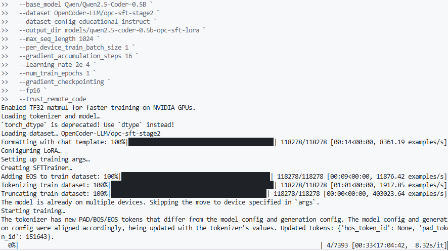

# LLM Fine-Tuning Project

Fine-tune Qwen2.5-Coder-0.5B on the OpenCoder SFT dataset, test locally (Ollama), and publish to Hugging Face.

## Training Status

Place your training status screenshot at the repository root as `image.png` and it will show here:



## Quickstart (Windows PowerShell)

1) Create venv and install dependencies

```powershell
python -m venv .venv
. .\.venv\Scripts\Activate.ps1
python -m pip install --upgrade pip

# Install a suitable PyTorch build first (CPU example shown)
pip install torch

# Then the rest
pip install -r requirements.txt
```

2) Inspect dataset (optional)

```powershell
# List available configs and instructions to re-run
python -m src.inspect_dataset --dataset OpenCoder-LLM/opc-sft-stage2 --split train --limit 3

# Example using a specific config
python -m src.inspect_dataset `
	--dataset OpenCoder-LLM/opc-sft-stage2 `
	--config educational_instruct `
	--split train `
	--limit 3
```

3) Fine-tune with LoRA

```powershell
python -m src.fine_tune `
	--base_model Qwen/Qwen2.5-Coder-0.5B `
	--dataset OpenCoder-LLM/opc-sft-stage2 `
	--dataset_config educational_instruct `
	--output_dir models/qwen2.5-coder-0.5b-opc-sft-lora `
	--max_seq_length 2048 `
	--per_device_train_batch_size 2 `
	--gradient_accumulation_steps 8 `
	--learning_rate 2e-4 `
	--num_train_epochs 1 `
	--gradient_checkpointing
```

Note: On NVIDIA GPUs, you can add `--fp16 --trust_remote_code` for faster training with mixed precision.

4) Merge and evaluate (optional)

```powershell
# Re-run training with merge enabled, or manually merge later
python -m src.fine_tune `
	--base_model Qwen/Qwen2.5-Coder-0.5B `
	--dataset OpenCoder-LLM/opc-sft-stage2 `
	--dataset_config educational_instruct `
	--output_dir models/qwen2.5-coder-0.5b-opc-sft-lora `
	--max_seq_length 2048 `
	--per_device_train_batch_size 2 `
	--gradient_accumulation_steps 8 `
	--learning_rate 2e-4 `
	--num_train_epochs 1 `
	--gradient_checkpointing `
	--save_merged --push_to_hub `
	--hub_model_id <your-username>/<repo-name>

# Evaluate merged model
python -m src.evaluate --model_path models/qwen2.5-coder-0.5b-opc-sft-lora/merged
```

5) Use with Ollama (local)

```powershell
python -m src.export_to_ollama `
	--source_path models/qwen2.5-coder-0.5b-opc-sft-lora/merged `
	--ollama_model_name my-qwen-coder-ft

ollama create my-qwen-coder-ft -f Modelfile
ollama run my-qwen-coder-ft
```

## Notes

- For best performance, install the correct CUDA-enabled PyTorch build for your GPU.
- If VRAM is limited, reduce `--max_seq_length`, `--per_device_train_batch_size`, or increase `--gradient_accumulation_steps`.
- Verify dataset and model licenses before sharing your fine-tuned weights.
